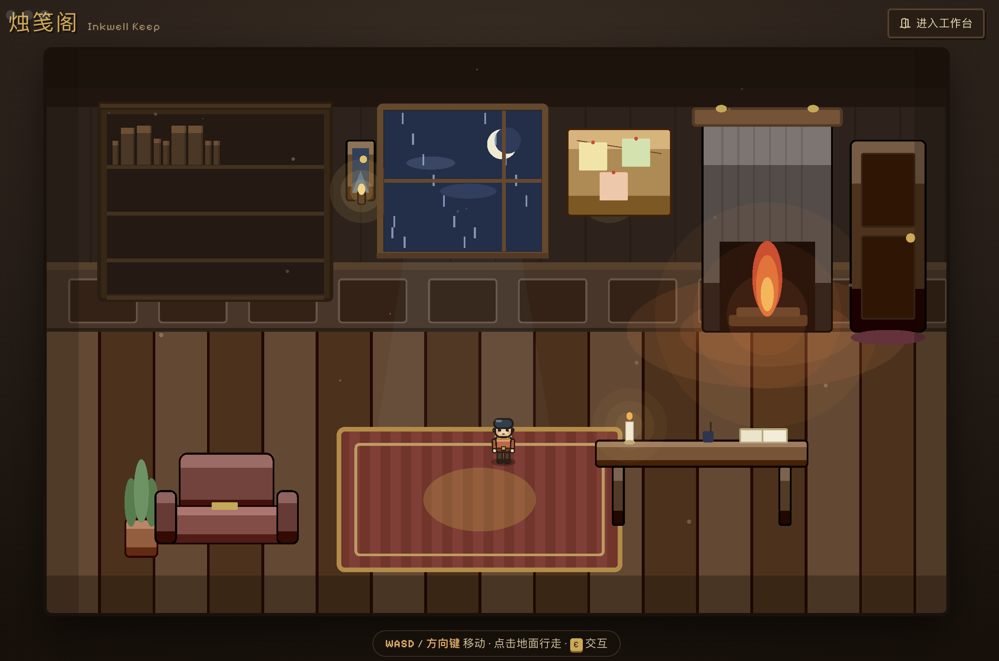

<div align="center">
  

  <h1>PrismMD</h1>

  <p>
    <strong>A beautiful, AI-native Markdown reader for macOS, Windows, and Linux.</strong>
  </p>

  <p>
    <a href="#license"></a>
    <a href="#prerequisites"></a>
    
    
    
    <a href="https://github.com/LHKong7/PrismMD/issues"></a>
  </p>

  <p>
    English | <a href="./README.zh-CN.md">简体中文</a>
  </p>

  
</div>

---

PrismMD is a cross-platform desktop app that treats Markdown as a first-class
thinking medium — a **personal knowledge base** rather than a folder of files:
notes link to each other with `[[wiki links]]`, every note carries its
backlinks and related notes, and the whole workspace is searchable and
answerable in English and Chinese, entirely on your machine. Render GFM, LaTeX and Mermaid side-by-side with an AI reading
assistant that can chat over the current document, remember past conversations,
and — optionally — pull context from a local knowledge graph built from every
document you save. And when you want to *write*, step through the door into
**烛笺阁 / Inkwell Keep** — a 2D pixel-art writing world where your articles are
books on a shelf and a guild of AI *scribes* helps you draft, critique and polish.

## Table of Contents

- [Inkwell Keep — a pixel writing world](#inkwell-keep--a-pixel-writing-world)
- [Features](#features)
- [Prerequisites](#prerequisites)
- [Quick Start](#quick-start)
- [Your notes as a knowledge base](#your-notes-as-a-knowledge-base)
- [Configuration](#configuration)
  - [AI Providers](#ai-providers)
  - [Knowledge Graph (optional)](#knowledge-graph-optional)
  - [Privacy Mode](#privacy-mode)
- [Build & Package](#build--package)
- [Project Structure](#project-structure)
- [Scripts](#scripts)
- [Tech Stack](#tech-stack)
- [Contributing](#contributing)
- [Security](#security)
- [Acknowledgements](#acknowledgements)
- [License](#license)

## Inkwell Keep — a pixel writing world

PrismMD has two faces. The quiet **workbench** — the reader, editor and AI
assistant — sits *behind* a playful **front stage**: **烛笺阁 / Inkwell Keep**, a
warm 2D pixel-art writing world you land in on launch. Walk a little scribe around
with **WASD / arrow keys / click**, and the rooms become your writing workflow.

<table>
  <tr>
    <td width="50%"></td>
    <td width="50%"></td>
  </tr>
  <tr>
    <td align="center"><em>阁中诸贤 / The Guild Hall — eight AI scribe agents</em></td>
    <td align="center"><em>写作圆桌 / The Round Table — critique a draft together</em></td>
  </tr>
</table>

- **典藏书柜 / The Stacks** — every article is a book on the shelf, and its spine
  reflects real metadata: length → thickness, genre → colour & material, quality →
  gold foil, status → faded *draft* / glowing *hot* / a red `!` for *needs revision*.
  Click a book to read or edit it.
- **阁中诸贤 / The Scribes** — eight NPC writing agents, each a distinct capability
  *and* persona: structure, titles, argument, language polish (de-AI), reader's-eye,
  SEO / distribution, technical review and style imitation. Walk up and chat — each
  uses your configured AI provider with its own system prompt.
- **写作圆桌 / The Round Table** — invite several scribes to critique the open
  document *at once*; a "chair" agent merges their notes into a prioritised,
  de-duplicated checklist you tick to generate a new version.
- **档案柜 / The Archive** — full version history with a line-diff and one-click,
  reversible rollback (round-table rewrites are snapshotted automatically).
- **灵感墙 / The Muse Wall** — collect topics, golden lines, snippets and opening
  candidates, by hand or AI-generated from the current draft.

Everything is rendered with [Pixi.js](https://pixijs.com/) — procedural pixel art,
no game assets. Prefer the plain workbench? The **Enter Workbench** button (top
right) drops you straight into the classic reader.

## Features

- **烛笺阁 / Inkwell Keep** — an optional pixel-art "writing world" front stage (see [above](#inkwell-keep--a-pixel-writing-world)): a walkable hub where your articles are books and a guild of AI *scribe* agents helps you draft, critique (round table), version (archive) and brainstorm (muse wall)
- **Markdown rendering** — full GitHub-flavored Markdown with syntax highlighting, KaTeX math and Mermaid diagrams
- **AI reading assistant** — chat with your documents using OpenAI, Anthropic, Google AI, local Ollama, or any OpenAI-compatible endpoint
- **Conversation memory** — the assistant remembers past discussions per file for richer follow-up answers
- **Your notes, linked** — write `[[Note title]]` anywhere to link one note to another, with `[[` autocomplete while you type. Every note gets **backlinks**, **related notes** and its **tags** in the Knowledge panel; a link to a note you have not written yet is a one-click prompt to write it, and renaming a note follows its links instead of breaking them
- **Search that actually finds things** — every note is chunked and indexed locally (SQLite FTS5 + BM25), in **English and Chinese**, with results ranked across body text, titles, tags and the link graph. No server, no configuration, nothing to add by hand
- **Ask your own notes** — the assistant retrieves passages from your whole workspace *as it is right now* and cites them by number; clicking a citation opens the note it came from and scrolls to the passage
- **Knowledge graph (opt-in)** — save documents as nodes in your own [Neo4j](https://neo4j.com/) instance and ask questions across them via [InsightGraph](https://www.npmjs.com/package/@insightgraph/sdk-embedded) graph-RAG
- **Privacy mode** — one click to block every external API call and force local-only models
- **Annotations** — highlight and note passages directly in the document
- **Table of contents** — auto-extracted from document headings, pinned to the side
- **File tree & file watching** — workspace explorer that hot-reloads on disk changes
- **Command palette** — `Ctrl/Cmd+P` to jump to files, themes, settings and actions
- **Themes & vibrancy** — light/dark plus system appearance, with native macOS vibrancy
- **Focus mode** — distraction-free reading with everything but the page dimmed
- **i18n** — English and Simplified Chinese out of the box

## Your notes as a knowledge base

PrismMD indexes every note in your workspace — automatically, locally, and with
nothing to switch on. Three things fall out of that:

**Links.** Type `[[` anywhere and pick a note; the link renders as a link and
the target note gains a **backlink**. A link to a note that does not exist yet
is not an error — it is shown as *not written yet*, and clicking it creates the
note. Rename a note and every `[[link]]` pointing at it is rewritten in place,
so improving a title never costs you the connections.

**Search.** Notes are split into passages at their headings and indexed with
SQLite's FTS5, ranked by BM25 across body text, titles, `#tags` and the link
graph. Searching works in **English and Chinese** — CJK text is indexed as
overlapping bigrams, because SQLite's stock tokenizer treats a whole Chinese
sentence as a single word and would silently find nothing.

**Answers with sources.** When you ask the assistant something, it retrieves
the relevant passages from your notes and is told to cite them as `[1]`, `[2]`.
Each citation is clickable: it opens the note the passage came from and scrolls
to it. That works with any provider, including a local Ollama model, and needs
no external service.

The **Knowledge** tab in the right sidebar shows where the open note sits:
what links here, what it links to, which notes are related (by link, tag or
wording), and its tags. **Settings → Knowledge** shows the index status and a
rebuild button.

> The separate [Knowledge Graph](#knowledge-graph-optional) feature is a
> different, optional thing: it extracts *entities* into a Neo4j instance you
> run yourself. The note index above needs none of that.

### Notes as files (optional)

By default your notes live in the app's database. **Settings → Storage** can
move them into a **vault**: a folder of ordinary Markdown files you can open in
Finder, in git, in Obsidian, or in any editor — while PrismMD keeps working
exactly as before.

```text
Vault/
├── Projects/PrismMD.md      a note, with a stable id in its front matter
├── Attachments/diagram.pdf  documents, as themselves
├── .trash/                  deleted notes, recoverable
└── .prism/                  app data
    ├── ui.json              sidebar order and icons — losable
    ├── binaries.json        ids for documents that cannot hold one — keep
    └── annotations/         your highlights — keep
```

The migration copies every note into a folder you choose, backs up your current
workspace first, and **checks the copy note by note** before switching anything
over; if a single note does not match, nothing changes and the partial copy is
left for you to inspect.

Once you are in a vault, edits made anywhere are picked up live. A note renamed
or moved in Finder stays the same note — its id lives in the file, so its
backlinks and highlights follow it. If you are mid-edit when a note changes on
disk, your unsaved text wins.

> Two things under `.prism/` are not caches: `binaries.json` and
> `annotations/`. Back those up with your notes; `ui.json` you can lose without
> consequence beyond alphabetical sidebar order.

## Prerequisites

- [Node.js](https://nodejs.org/) `>= 18`
- [npm](https://www.npmjs.com/) `>= 9`
- *(optional)* [Ollama](https://ollama.com/) for local LLM inference
- *(optional)* [Neo4j](https://neo4j.com/) `>= 5` reachable over Bolt — only required if you turn on the Knowledge Graph feature

## Quick Start

```bash
# 1. Clone
git clone https://github.com/LHKong7/PrismMD.git
cd PrismMD

# 2. Install
npm install

# 3. Run in development mode (Vite dev server + Electron with hot reload)
npm run dev
```

On first launch, open **Settings** (`Ctrl/Cmd + ,`) to wire up an AI provider.

## Configuration

All configuration happens inside the app — nothing is hard-coded. Settings are
persisted with [`electron-store`](https://github.com/sindresorhus/electron-store)
under your platform's per-user data directory.

### AI Providers

Open **Settings → AI** to enable one or more providers:

| Provider      | Type       | What you need                                                                 |
| ------------- | ---------- | ----------------------------------------------------------------------------- |
| **OpenAI**    | Cloud      | API key — [platform.openai.com](https://platform.openai.com/)                 |
| **Anthropic** | Cloud      | API key — [console.anthropic.com](https://console.anthropic.com/)             |
| **Google AI** | Cloud      | API key — [aistudio.google.com](https://aistudio.google.com/)                 |
| **Ollama**    | Local      | Install Ollama and pull a model. No API key. Default endpoint `localhost:11434` |
| **Custom**    | Any        | Any OpenAI-compatible endpoint (vLLM, LM Studio, self-hosted, …)              |

Pick an active provider and model, hit **Activate**, then open the AI sidebar
(`Ctrl/Cmd + /` or the robot icon) to start chatting about the document you
have open.

### Knowledge Graph (optional)

PrismMD can embed the [InsightGraph](https://www.npmjs.com/package/@insightgraph/sdk-embedded)
pipeline so every document you save becomes a node in a knowledge graph —
useful for cross-document Q&A.

1. Start a Neo4j instance, e.g. via Docker:
   ```bash
   docker run -p 7687:7687 -e NEO4J_AUTH=neo4j/mypassword neo4j:5
   ```
2. In **Settings → Knowledge Graph**, enter the Bolt URI, username and password, then **Test Connection**.
3. Enable the feature. InsightGraph reuses your **active AI provider** for entity extraction — it needs an OpenAI-compatible provider (OpenAI / Ollama / Custom). Anthropic and Google are flagged in the UI as unsupported.
4. Save a document to the graph via the command palette (`Save Document to Knowledge Graph`) or by right-clicking a `.md` file in the explorer.
5. Chat as usual — the assistant will transparently pull answers from the graph alongside the current document.

### Privacy Mode

Flip **Settings → Privacy → Privacy Mode** to block every external API call.
When active:

- Only **Ollama** (local) can be selected as an AI provider.
- The Knowledge Graph feature refuses to run unless Ollama is active.
- No telemetry or remote calls are made.

## Build & Package

Production builds use [Electron Forge](https://www.electronforge.io/) with two
build profiles — a lightweight `dev` profile for local iteration and a full
`prod` profile for distribution. The active profile is chosen automatically
from `APP_PROFILE` > `npm_lifecycle_event` > `NODE_ENV`. See
[`build-config/profiles.ts`](build-config/profiles.ts).

| Command              | Profile  | Output             | Notes                                     |
| -------------------- | -------- | ------------------ | ----------------------------------------- |
| `npm run dev`        | `dev`    | —                  | Hot-reload dev server                     |
| `npm run package`    | `prod`   | `out/dist`         | Packaged app, no installer                |
| `npm run make`       | `prod`   | `out/dist/make`    | Platform installers (DMG / Squirrel / Deb / ZIP) |
| `./scripts/build.sh` | `prod`   | `out/dist`         | Wrapper script with preflight checks      |

### `scripts/build.sh`

Wrapper that runs: Node version check → `npm ci` → `tsc --noEmit` →
`electron-forge make` (or `package`).

```bash
./scripts/build.sh                     # Installer for current platform
./scripts/build.sh --package           # Package without installer
./scripts/build.sh --platform darwin   # macOS
./scripts/build.sh --platform win32    # Windows
./scripts/build.sh --platform linux    # Linux
./scripts/build.sh --profile dev       # Force the dev profile
./scripts/build.sh --skip-typecheck    # Faster iteration
./scripts/build.sh --skip-install      # Faster iteration
```

Supported targets out of the box:

- **macOS** — `.dmg`, `.zip`
- **Windows** — Squirrel installer (`.exe`)
- **Linux** — `.deb`

## Project Structure

```
PrismMD/
├── electron/                      # Electron main process (Node)
│   ├── main.ts                    # App entry, window lifecycle
│   ├── preload.ts                 # Context bridge (typed IPC API)
│   ├── ipc/                       # IPC handler registration
│   ├── knowledge/                 # Note index — tokenizer, chunker, link parser,
│   │                              #   ranking, SQLite/FTS5 engine (pure, unit-tested)
│   └── services/                  # Main-process services
│       ├── aiService.ts           # AI agent (borderless-agent)
│       ├── memoryService.ts       # Conversation memory
│       ├── knowledgeService.ts    # Note index scheduling + IPC-facing reads
│       ├── insightGraphService.ts # Graph-RAG (optional)
│       ├── fileWatcher.ts         # chokidar-based file watching
│       └── settingsStore.ts       # Persistent settings
├── src/                           # Renderer (React 18 + Tailwind)
│   ├── components/                # UI
│   │   ├── agent/                 # AI chat sidebar
│   │   ├── frontstage/            # 烛笺阁 pixel world (Pixi.js): rooms, scribes, round table, archive, shelf
│   │   ├── reader/                # Markdown renderer + pipeline
│   │   ├── knowledge/             # Wiki links + Knowledge panel (backlinks, related)
│   │   ├── filetree/              # Explorer with context menu
│   │   ├── settings/              # Settings panel (AI, Graph, Privacy)
│   │   └── layout/                # AppShell, StatusBar, TitleBar
│   ├── store/                     # Zustand stores
│   ├── i18n/                      # en.json, zh.json
│   └── lib/                       # Shared utilities
├── build-config/                  # Forge build profiles (dev / prod)
├── scripts/build.sh               # Production build wrapper
├── app.config.ts                  # App identity (name, bundle id, icon)
├── forge.config.ts                # Electron Forge config
├── vite.main.config.ts            # Vite config — main process
├── vite.preload.config.ts         # Vite config — preload
├── vite.renderer.config.ts        # Vite config — renderer
└── package.json
```

## Scripts

| Command              | Description                                              |
| -------------------- | -------------------------------------------------------- |
| `npm run dev`        | Start the app with hot reload (alias of `npm start`)     |
| `npm start`          | Same as `npm run dev`                                    |
| `npm run package`    | Package the app without creating an installer           |
| `npm run make`       | Build platform installers                                |
| `npm run typecheck`  | Run `tsc --noEmit` across the whole project              |

## Tech Stack

- **[Electron](https://www.electronjs.org/)** — cross-platform desktop shell
- **[Electron Forge](https://www.electronforge.io/)** — build, package and publish pipeline
- **[React 18](https://react.dev/) + [Vite](https://vitejs.dev/)** — renderer
- **[Tailwind CSS](https://tailwindcss.com/)** — styling
- **[Zustand](https://github.com/pmndrs/zustand)** — state management
- **[Pixi.js](https://pixijs.com/)** — WebGL renderer powering the 烛笺阁 / Inkwell Keep pixel-art front stage
- **[unified](https://unifiedjs.com/) / remark / rehype** — Markdown processing pipeline
- **[borderless-agent](https://www.npmjs.com/package/borderless-agent)** — agentic AI framework powering the chat
- **[@insightgraph/sdk-embedded](https://www.npmjs.com/package/@insightgraph/sdk-embedded)** — embedded graph-RAG (optional)
- **[neo4j-driver](https://www.npmjs.com/package/neo4j-driver)** — Bolt client for the optional knowledge graph
- **[i18next](https://www.i18next.com/) + [react-i18next](https://react.i18next.com/)** — i18n

## Contributing

Contributions, bug reports and feature ideas are welcome.

1. **Open an issue first** for anything larger than a typo — it helps avoid duplicated work and lets us agree on scope.
2. **Fork** and create a branch from `main` with a descriptive name (e.g. `feat/graph-export`, `fix/toc-scroll`).
3. **Make your change**, keeping the diff focused. Run `npm run typecheck` before submitting.
4. **Open a pull request** describing *what* changed and *why*. Reference the issue it fixes if any.

### Development tips

- Use `npm run dev` and keep it running — Vite hot-reloads the renderer and Electron auto-restarts on main-process changes.
- The preload is the only bridge between main and renderer. If you add a new IPC channel, wire it through both [`electron/preload.ts`](electron/preload.ts) and a handler under [`electron/ipc/`](electron/ipc).
- Renderer state belongs in a Zustand store under [`src/store/`](src/store). Read other stores for existing conventions (load/save persistence, event subscriptions, etc.).
- Add translation keys to **both** [`src/i18n/locales/en.json`](src/i18n/locales/en.json) and [`src/i18n/locales/zh.json`](src/i18n/locales/zh.json) whenever you add user-visible strings.
- Commit messages follow [Conventional Commits](https://www.conventionalcommits.org/) (`feat:`, `fix:`, `build:`, `docs:`, `refactor:`, `chore:`).

### Code style

- TypeScript strict mode — prefer explicit types over `any`.
- Functional React components with hooks; no classes.
- Tailwind utility classes for styling; use CSS variables (`var(--accent-color)` etc.) for theme-aware colors so dark mode and custom themes keep working.

## Security

**Do not open a public issue for security vulnerabilities.** Instead, email
the maintainer or use GitHub's [private security advisories](https://github.com/LHKong7/PrismMD/security/advisories/new).
We'll acknowledge reports within a reasonable timeframe and coordinate a fix.

PrismMD stores every AI API key and the Neo4j password locally via
`electron-store` — nothing is transmitted except to the provider endpoints you
configure. Privacy Mode blocks even those.

## Acknowledgements

PrismMD stands on the shoulders of many open-source projects. A few of the
biggest ones:

- [Electron](https://www.electronjs.org/) and [Electron Forge](https://www.electronforge.io/)
- [Vite](https://vitejs.dev/) and [React](https://react.dev/)
- [unified](https://unifiedjs.com/), [remark](https://github.com/remarkjs/remark), [rehype](https://github.com/rehypejs/rehype)
- [KaTeX](https://katex.org/) and [Mermaid](https://mermaid.js.org/)
- [Tailwind CSS](https://tailwindcss.com/)
- [Zustand](https://github.com/pmndrs/zustand)
- [lucide-react](https://lucide.dev/)
- [cmdk](https://cmdk.paco.me/)
- [Ollama](https://ollama.com/)
- [Neo4j](https://neo4j.com/) and [neo4j-driver](https://www.npmjs.com/package/neo4j-driver)
- [borderless-agent](https://www.npmjs.com/package/borderless-agent)
- [@insightgraph/sdk-embedded](https://www.npmjs.com/package/@insightgraph/sdk-embedded)

Thank you to everyone who ships and maintains these libraries.

## License

PrismMD is released under the [MIT License](LICENSE). Copyright © 2026 LHKong7.
